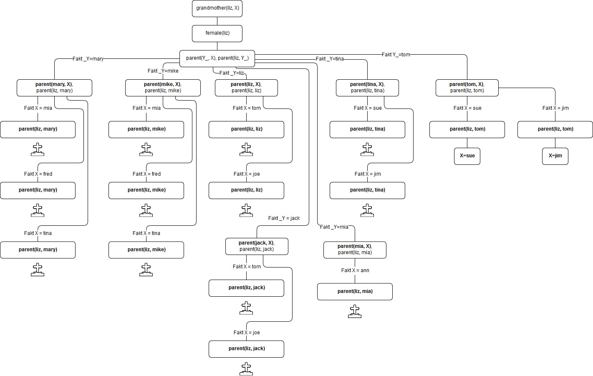

# PCP Übung zu Prolog 1 + 2

## Verwandschaftsbeziehungen

### a)
```pl
mother(X, jim).
father(X, jim).

mother(mary, X).
```

### c)
```pl
grandmother(X, jim).
X = mary ;
X = liz.
```

### d)
```pl
?- offspring(sue, X).
X = tina ;
X = tom ;
X = mary ;
X = mike ;
X = liz ;
X = jack ;
false.
```

## Matching & Suchbaum

### a)


### b)


## Kreuzworträtsel lösen
1st|2nd|3rd|4th|5th|6th|
---|---|---|---|---|---|
-| L1 |-|-|-|-|
L2 | L3 | L4 | L5  |-|-|
-| L6 |-| L7  |-|-|
-| L8 | L9 | L10 | L11 | L12 |

```pl
?- crosswords(L1, L2, L3, L4, L5, L6, L7, L8, L9, L10, L11, L12).
L1 = g,
L2 = b,
L3 = r,
L4 = L7, L7 = o,
L5 = L10, L10 = t,
L6 = a,
L8 = u,
L9 = L12, L12 = n,
L11 = e .
```

1st|2nd|3rd|4th|5th|6th|
---|---|---|---|---|---|
-| g |-|-|-|-|
b | r | o | t  |-|-|
-| a |-| o  |-|-|
-| u | n | t | e | n |


## Karte färben
```pl
?- consult('karteFaerben.pl').
true.

?- colors(LU, NW, OW, SZ, UR, ZG).
LU = UR, UR = yellow,
NW = ZG, ZG = green,
OW = SZ, SZ = red
false.
```
Es existiert nur eine Lösung für diese Aufgabe.

## Eigene Familien-Operatoren definieren

### a)
```pl
?- op(1150, xfx, mother).
true.

?- liz mother X.
X = tom ;
X = joe.
```

### b)
```pl
?- op(1150, xfx, offspring).
true.

?- ann offspring mike.
true .
```

## Operatoren und arithmetische Ausdrücke

### a)
```pl
?- X is 16 / 4 / 2
|    .
X = 2.
```
Der Term ist eine Infix Operationstyp: yfx
In Prolog wird es als (16 / 4) / 2 ausgewertet. Da der rechte Operand nicht selber ein //2-Operation sein darf.

### b)
```pl
?- Y = 3, X = Y - 1
|    .
Y = 3,
X = 3-1.
```
Es ist keine Arithmetische Operation, sondern ein Matching!

### c)
```pl
?- Y = 3, X is Y - 1.
Y = 3,
X = 2.
```
Erst mit dem is/2-Operator werden die Operanden ausgewertet.

## Multiplikation durch rekursive Addition

### a)
```pl
?- mult(3, 4, X).                                                                                                  │~                                                                                                                  
X = 12 ;                                                                                                           │~                                                                                                                  
X = 12 ;                                                                                                           │~                                                                                                                  
ERROR: Out of local stackk
```

### b)
Dieser Fehler taucht aufgrund einer unendlicher Rekursion auf. Man müsste eine Abbruchbedingung festlegen => Zuerst prüfen ob m grösser als 0 ist
