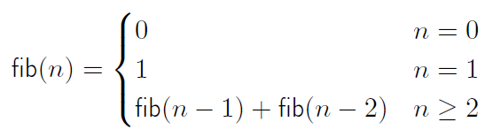

# Exercise 07

## 1. Aufgabe
Sie haben das Sortierens durch Einfügen aus „Programmierübung zu Scheme 3+4“ mit einem zusätzlichen Parameter implementiert:

```racket
; Sortieren durch Einfügen
(define (sort-a-list op a-list)
	(cond
		((empty? a-list) empty)
		(else (insert op (first a-list)
		(sort-a-list op (rest a-list))))
	)
)

; Einfügen in sortierter Liste
(define (insert op item a-list)
	(cond
		((empty? a-list) (list item))
		((op item (first a-list)) (cons item a-list))
		(else (cons (first a-list) (insert op item (rest a-list))))
	)
)
```

Die Hilfsfunktion insert wird eigentlich nur innerhalb der Funktion `sort-by-insert` benötigt. Integrieren Sie deshalb die Hilfsfunktion `insert` als lokale Funktion in die Funktion `sort-by-insert`.

```racket
(define (sort-a-list param-op param-a-list)
  (local (
          ; Sortieren durch Einfügen
          (define (sort-main op a-list)
            (cond
              ((empty? a-list) empty)
              (else (insert op (first a-list)
                            (sort-main op (rest a-list))))
              )
            )
          ; Einfügen in sortierter Liste
          (define (insert op item a-list)
            (cond
              ((empty? a-list) (list item))
              ((op item (first a-list)) (cons item a-list))
              (else (cons (first a-list) (insert op item (rest a-list))))
              )
            )
          )
          (sort-main param-op param-a-list)
    )
  )
```
## 2. Aufgabe *
Sie kennen die Fibonacci-Folge:



Die Definition einer strukturellen Rekursion könnte so aussehen

```racket
(define (fib n)
	(cond
		((or (= n 0) (= n 1)) n)
		(else (+ (fib (- n 1))
		(fib (- n 2)))))
)
```

### a) Implementieren Sie eine Rekursion mit Akkumulator. Nutzen Sie dazu die local Definition.

### b) Führen Sie Vergleich Tests mit und ohne Akkumulator durch. Welche Unterschiede sehen Sie?

## 3. Aufgabe *

### a) Was ist die Ausgabe des folgenden Scheme-Programms?
```racket
(define a 42)

(let ((a 1)
(b (+ a 1)))
b)

(let* ((a 1)
(b (+ a 1)))

b)
```

```racket
43
2
>
```

### b) Erklären Sie, warum sich die beiden Ausdrücke unterscheiden.
Bei der ersten Ausgabe ist die Variable a noch nicht an 1 gebunden, wenn b mit (+ a 1) ausgewertet wird.
Bei der zweiten Ausgabe wird das sequenzielle let verwendet. Dies führt dazu, dass von links nach rechts ausgewertet wird.


## Anonyme Funktionen
(Einstellung in DrRacket: "Advanced Student")

## 4. Aufgabe *

### a) Was ist die Ausgabe des folgenden Scheme-Programms?
```racket
(define x 1)
(define y 5)

(
	(lambda (x y)
		(+ (* 2 x) y))
		y x
)

(
	(lambda (a b)
		(+ (* 2 x) y))
		y x
)
```

### b) Erklären Sie, warum sich die beiden Ausdrücke unterscheiden.

## 5. Aufgabe *
Angenommen, man hat die Liste
```racket
(define a-list (list (list 1 2 3) (list 1 2) (list 1 2 3 4)))
```
und möchte jede Liste mit 0 beginnen lassen. Wie kann man dies erreichen, ohne, dass extra eine Funktion (mit Namen) geschrieben werden muss?

```racket
(map (lambda (other-list) (cons 0 other-list)) a-list)
```

## 6. Aufgabe *
Angenommen, man hat eine Liste mit Funktionen zur Berechnung von Eigenschaften eines Rechteckes, hier Fläche und Umfang:

```racket
(define rect-calc-list
(list (lambda (a b) (* a b)) (lambda (a b) (* 2 (+ a b)))))
```

Implementieren Sie eine Funktion, der man die Liste mit Funktionen und die Seiten eines Rechteckes übergeben kann, dann die Eigenschaften berechnet und ausgibt.
Eine mögliche Interaktion könnte so aussehen:

```racket
> (calc-a-list rect-calc-list 2 3)
6
10
finished
> (calc-a-list rect-calc-list 5 5)
25
20
finished
>
```

## Funktionen mit Gedächtnis
(Einstellung in DrRacket: "Advanced Student")

## 7. Aufgabe
Wir haben ein globales Verzeichnis mit Vornamen und Telefonnummer von Personen:
```racket
(define my-phone-dir (list (list 'Adam 4711) (list 'Eva 4712)))
```

Ein Programm soll zwei Möglichkeiten bieten:
	1. Suchen der Nummer anhand des Vornamens, etwa durch
```racket
; nachschauen: liste symbol --> zahl oder false
(define (look-at phone-dir name) (...))
```

	2. Hinzufügen einer neuen Person mittels Vornamen und Nummer im globalen Verzeichnis
```racket
; hinzufuegen: symbol zahl --> void
(define (add-entry name number) (...))
```

Eine mögliche Interaktion könnte dann folgendermassen verlaufen:

```racket
> (look-at my-phone-dir 'Adam)
4711
> (look-at my-phone-dir 'Erna)
#false
> (add-entry 'Erna 4715)
(void)
; dies bedeutet, dass die Funktion add-entry nichts zurück gibt
> (look-at my-phone-dir 'Erna)
4715
```

### a) Warum widerspricht diese Interaktion fundamental unserem bisherigen funktionalen Programmiergrundsatz?

### b) Schreiben Sie die Funktion look-at für das Suchen der Nummer anhand des Vornamens

### c) Schreiben Sie die Funktion add-entry für das Hinzufügen einer neuen Person mit Vornamen und Nummer.
