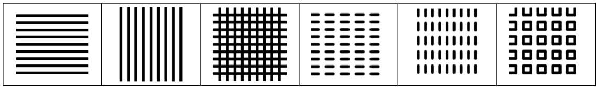

# Exercise 07

## 1. Aufgabe
Sie haben das Sortierens durch Einfügen aus „Programmierübung zu Scheme 3+4“ mit einem zusätzlichen Parameter implementiert:

```racket
; Sortieren durch Einfügen
(define (sort-a-list op a-list)
	(cond
		((empty? a-list) empty)
		(else (insert op (first a-list)
		(sort-a-list op (rest a-list))))
	)
)

; Einfügen in sortierter Liste
(define (insert op item a-list)
	(cond
		((empty? a-list) (list item))
		((op item (first a-list)) (cons item a-list))
		(else (cons (first a-list) (insert op item (rest a-list))))
	)
)
```

Die Hilfsfunktion insert wird eigentlich nur innerhalb der Funktion `sort-by-insert` benötigt. Integrieren Sie deshalb die Hilfsfunktion `insert` als lokale Funktion in die Funktion `sort-by-insert`.

```racket
(define (sort-a-list param-op param-a-list)
  (local (
          ; Sortieren durch Einfügen
          (define (sort-main op a-list)
            (cond
              ((empty? a-list) empty)
              (else (insert op (first a-list)
                            (sort-main op (rest a-list))))
              )
            )
          ; Einfügen in sortierter Liste
          (define (insert op item a-list)
            (cond
              ((empty? a-list) (list item))
              ((op item (first a-list)) (cons item a-list))
              (else (cons (first a-list) (insert op item (rest a-list))))
              )
            )
          )
          (sort-main param-op param-a-list)
    )
  )
```
## 2. Aufgabe *
Sie kennen die Fibonacci-Folge:


Die Definition einer strukturellen Rekursion könnte so aussehen

```racket
(define (fib n)
	(cond
		((or (= n 0) (= n 1)) n)
		(else (+ (fib (- n 1))
		(fib (- n 2)))))
)
```

### a) Implementieren Sie eine Rekursion mit Akkumulator. Nutzen Sie dazu die local Definition.
```racket
(define (fib n)
  (local (
          (define (fib-acc x current previous)
            (cond
                   ((equal? x n) current)
                   (else (fib-acc (+ x 1)  (+ current previous) current))
            ))
          )
    (fib-acc 0 0 1)))
```
### b) Führen Sie Vergleich Tests mit und ohne Akkumulator durch. Welche Unterschiede sehen Sie?
Mit Akkumulator geht die Berechnung für zum Beispiel 30 schneller als ohne Akkumulator. Siehe PCP Woche 03.

## 3. Aufgabe *

### a) Was ist die Ausgabe des folgenden Scheme-Programms?
```racket
(define a 42)

(let ((a 1)
  (b (+ a 1)))
b)

(let* ((a 1)
(b (+ a 1)))

b)
```

```racket
43
2
>
```

### b) Erklären Sie, warum sich die beiden Ausdrücke unterscheiden.
Bei der ersten Ausgabe ist die Variable a noch nicht an 1 gebunden, wenn b mit (+ a 1) ausgewertet wird.
Bei der zweiten Ausgabe wird das sequenzielle let verwendet. Dies führt dazu, dass von links nach rechts ausgewertet wird.


## Anonyme Funktionen
(Einstellung in DrRacket: "Advanced Student")

## 4. Aufgabe *

### a) Was ist die Ausgabe des folgenden Scheme-Programms?
```racket
(define x 1)
(define y 5)

(
	(lambda (x y)
		(+ (* 2 x) y))
		y x
)

(
	(lambda (a b)
		(+ (* 2 x) y))
		y x
)
```

```racket
11
7
```

### b) Erklären Sie, warum sich die beiden Ausdrücke unterscheiden.
Im ersten lambda-Ausdruck:
1. Zuweisung von links nach rechts: y (5) -> x , x (1) -> y
2. Verdoppelung x: 10
3. Addition von y (1) zu 2x (10): 11

Im zweiten lambda Ausdruck:
1. Zuweisung von links nach rechts: y (5) -> a , x (1) -> b
2. Verdoppelung x: 2
3. Addition von y (5) zu 2x (2): 7

Im Zweiten werden a und b zugewiesen aber nie verwendet.
```racket
(
	(lambda (a b)
		(+ (* 2 a) b))
		y x
)
```

## 5. Aufgabe *
Angenommen, man hat die Liste
```racket
(define a-list (list (list 1 2 3) (list 1 2) (list 1 2 3 4)))
```
und möchte jede Liste mit 0 beginnen lassen. Wie kann man dies erreichen, ohne, dass extra eine Funktion (mit Namen) geschrieben werden muss?

```racket
(map (lambda (other-list) (cons 0 other-list)) a-list)
```

## 6. Aufgabe *
Angenommen, man hat eine Liste mit Funktionen zur Berechnung von Eigenschaften eines Rechteckes, hier Fläche und Umfang:

```racket
(define rect-calc-list
(list (lambda (a b) (* a b)) (lambda (a b) (* 2 (+ a b)))))
```

Implementieren Sie eine Funktion, der man die Liste mit Funktionen und die Seiten eines Rechteckes übergeben kann, dann die Eigenschaften berechnet und ausgibt.
Eine mögliche Interaktion könnte so aussehen:

```racket
> (calc-a-list rect-calc-list 2 3)
6
10
finished
> (calc-a-list rect-calc-list 5 5)
25
20
finished
>
```

```racket
(define rect-calc-list
  (list (lambda (a b) (* a b)) (lambda (a b) (* 2 (+ a b))))
)
(define (calc-a-list functionlist a b)
  (if (empty? functionlist)
    ((write 'finished)
     (newline))
    (
      (write ((first functionlist) a b))
      (newline)
      (calc-a-list (rest functionlist) a b)
    )
  )
)
```

Programm gibt eine Liste der berechneten Eigenschaften aus:
```racket
> (calc-a-list rect-calc-list 2 3)
(list 6 10)
> (calc-a-list rect-calc-list 5 5)
(list 25 20)
> 
```

## Funktionen mit Gedächtnis
(Einstellung in DrRacket: "Advanced Student")

## 7. Aufgabe
Wir haben ein globales Verzeichnis mit Vornamen und Telefonnummer von Personen:
```racket
(define my-phone-dir (list (list 'Adam 4711) (list 'Eva 4712)))
```

Ein Programm soll zwei Möglichkeiten bieten:
	1. Suchen der Nummer anhand des Vornamens, etwa durch
```racket
; nachschauen: liste symbol --> zahl oder false
(define (look-at phone-dir name) (...))
```

	2. Hinzufügen einer neuen Person mittels Vornamen und Nummer im globalen Verzeichnis
```racket
; hinzufuegen: symbol zahl --> void
(define (add-entry name number) (...))
```

Eine mögliche Interaktion könnte dann folgendermassen verlaufen:

```racket
> (look-at my-phone-dir 'Adam)
4711
> (look-at my-phone-dir 'Erna)
#false
> (add-entry 'Erna 4715)
(void)
; dies bedeutet, dass die Funktion add-entry nichts zurück gibt
> (look-at my-phone-dir 'Erna)
4715
```

### a) Warum widerspricht diese Interaktion fundamental unserem bisherigen funktionalen Programmiergrundsatz?
Wenn man die Funktion add-entry mehrmals mit den gleichn Inputs aufruft, dann resultiert ein jedesmal ein anderes Ergebnis. Dies ist nicht mehr funktional!

### b) Schreiben Sie die Funktion look-at für das Suchen der Nummer anhand des Vornamens
```racket
(define (look-at phone-dir name)
  (cond
    ((empty? phone-dir) #false)
    ((equal? (first (first phone-dir)) name) (first (rest (first phone-dir))))
    (else
     (look-at (rest phone-dir) name))
    )
)
```

### c) Schreiben Sie die Funktion add-entry für das Hinzufügen einer neuen Person mit Vornamen und Nummer.
```racket
(define (add-entry name number)
  (set! my-phone-dir (append my-phone-dir (list (list name number))))
  )
```
## GIMP Skript

### a) Schreiben Sie ein GIMP Skript, das ein konfigurierbares Gitternetz im GIMP zeichnet. Die Vorlage enthält, dass ein neues Bild erstellt wird, Hintergrund- und Strichfarbe konfigurierbar sind, der Hintergrund transparent eingestellt werden kann. Sie müssen das Zeichnen der folgenden Gitternetz-Varianten umsetzen:



### b) Erstellen Sie ein neues GIMP Skript, basierend auf dem Skript aus a), mit dem man auf ein bestehendes Bild ein konfigurierbares Gitternetz im GIMP zeichnen kann. Der Konfigurationsdialog soll nur noch die Parameter enthalten, die tatsächlich notwendig sind.
