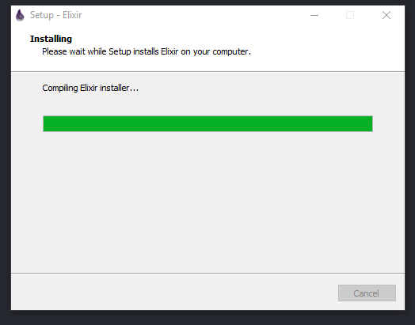
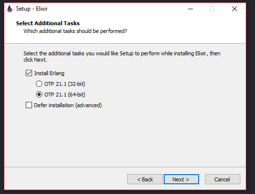
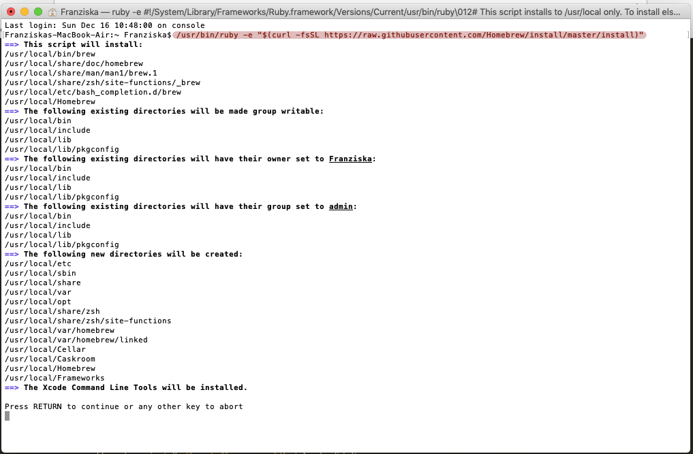
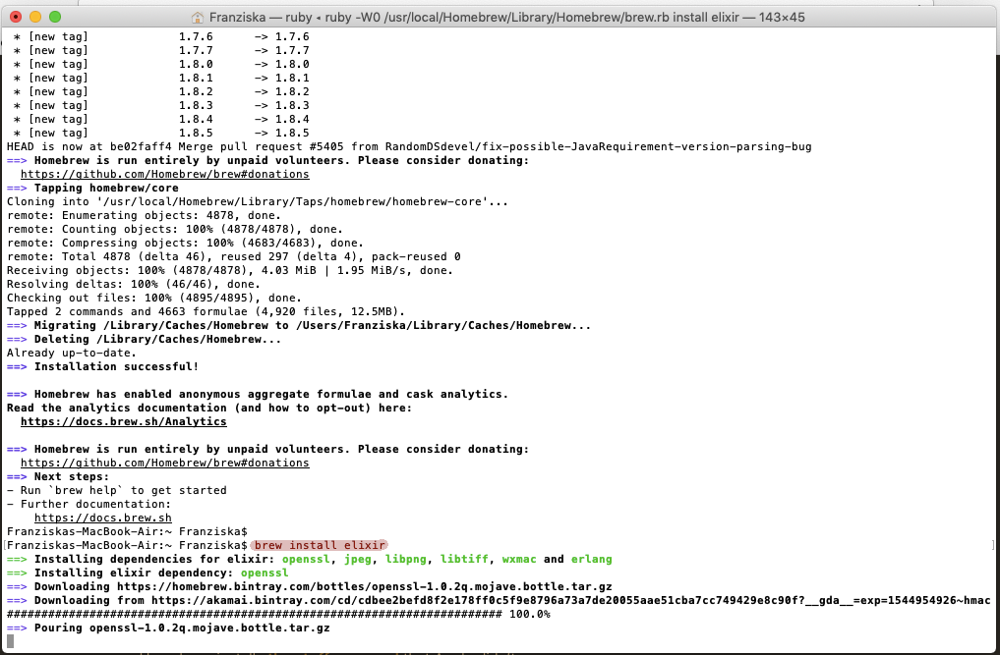
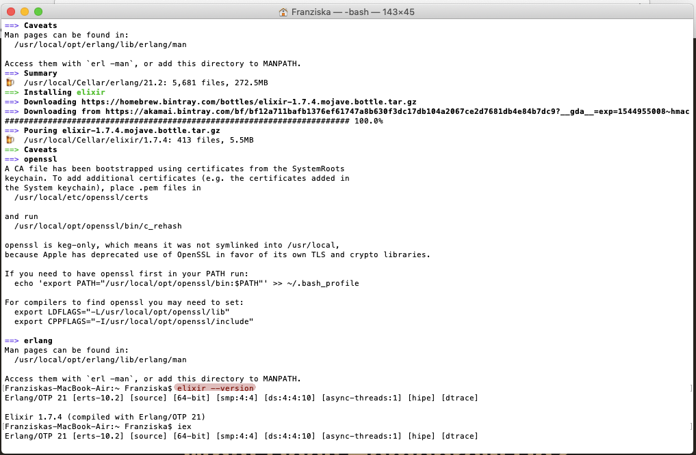

# Installationsanleitung Elixir

## Windows
1. Web-Installer [downloaden](https://repo.hex.pm/elixir-websetup.exe)
2. Ausführen, Erlang VM und Elixir werden installiert





3. (optional) Um iex & elixir mit Powershell benutzen zu können:
* PowerShell öffnen
* `notepad $PROFILE` ausführen
* folgenden Text zu Profil hinzufügen:

```Powershell
Remove-Item alias:\iex -Force
$OutputEncoding = [console]::InputEncoding = [console]::OutputEncoding = New-Object System.Text.UTF8Encoding
```

## Mac OS X
1. Homebrew installieren mit
```Terminal
/usr/bin/ruby -e "$(curl -fsSL https://raw.githubusercontent.com/Homebrew/install/master/install)"
```



2. Elixir über Homebrew installieren
```Terminal
brew install elixir
```





## Unix
